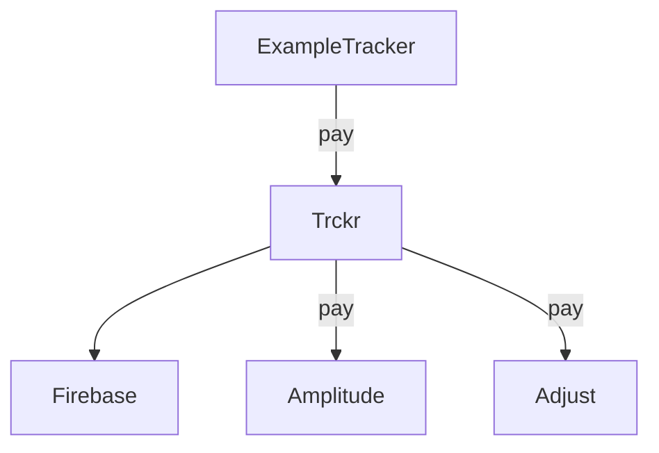

### Skip adapters

It's not always needed to send event to all registered adapters. To use such methods in common tracker interface you can specify adapters that will be skipped in `@Event` annotation.

```kotlin
@Tracker
interface ExampleTracker {
    
    @Event(skipAdapters = [FirebaseAdapter::class])
    fun pay(@Param("amount") amount: Double)
}
```

<div class="centered">

</div>

### Nullable parameter handling

#### Skip null parameters

Nullable parameters with help of default converter would be converted to string "null". But if you want to skip such parameter you can set track strategy to `TrackStrategy.SKIP_IF_NULL`, and it will be sent only if value is not null.

```kotlin
@Tracker
interface ExampleTracker {
    
    @Event
    fun userSearch(
        @Param(
            name = "query",
            strategy = TrackStrategy.SKIP_IF_NULL,
        )
        query: String? = null,
    )
}
```

#### Track null parameters

Parameter converter or type converter should convert value to any not null type. If you need to track null explicitly you can set track strategy to `TrackStrategy.TRACK_NULL`.
```kotlin
@Tracker
interface ExampleTracker {
    
    @Event
    fun userSearch(
        @Param(
            name = "query",
            strategy = TrackStrategy.TRACK_NULL,
        )
        query: String? = null,
    )
}
```

#### Default behavior

By default, any parameter tries to be converted using type or parameter converters. If none of converters can convert this value (return not null) `TrckrConversionException` exception will be thrown. 

### Converters

To clean up call place you can register converter that would convert parameter value to desired format.

#### Type converters

Type converter can convert parameter value based only on the value itself. It's suitable when you need to convert all values of certain type.
```kotlin
class EnumConverter : TypeConverter {
    
    fun convert(value: Any?): Any? {
        return if (value is Enum<*>) {
            value.name
        } else {
            null
        }
    }
}

val tracker = createExampleTracker {
    // ...
    addConverter(EnumConverter())
}
```

#### Parameter converters

Parameter converter can convert parameter value based on event name, parameter name and passed value. It's allows to convert specific values, even if they are typed with type that converts to another representation by type converter, because trckr check parameter converters before type converters.
```kotlin
@Tracker
interface ExampleTracker {
    
    @Event
    fun event(
        @Param("first") first: Int,
        @Param("second") second: Int,
    )
}

class FirstParameterConverter : ParameterConverter {
    
    fun convert(eventName: String, parameterName: String, value: Any?): Any? {
        return if (event == "event" && parameterName == "first") {
            val isPositive = (value as Int) > 0
            if (isPositive) "Positive" else "Negative"
        } else {
            null
        }
    }
}

val tracker = createExampleTracker {
    // ...
    addConverter(FirstConverter())
}
tracker.event(first = -10, second = 20)
```

!!! --- "Note"
    Parameters converter is a more powerful solution that let you manipulate event parameters, but you need to be careful because this type of converter applies to all parameters of all events in tracker.

### Multi module support

Trckr supports multimodule projects. You can define module-scoped trackers inside each module like this:

```kotlin
// Module alpha
interface ModuleAlphaTracker {

    @Event
    fun alphaEvent()
}

// Module beta
interface ModuleBetaTracker {
    
    @Event
    fun betaEvent()
}
```

And then, in application module you tie all trackers together:
```kotlin
@Tracker
interface ApplicationTracker : ModuleAlphaTracker, ModuleBetaTracker
```
**trckr** generate `ApplicationTracker` implementation for you, with all events from inherited tracker
interfaces. So you can create tracker and inject it with your DI framework to modules (or pass it manually).
