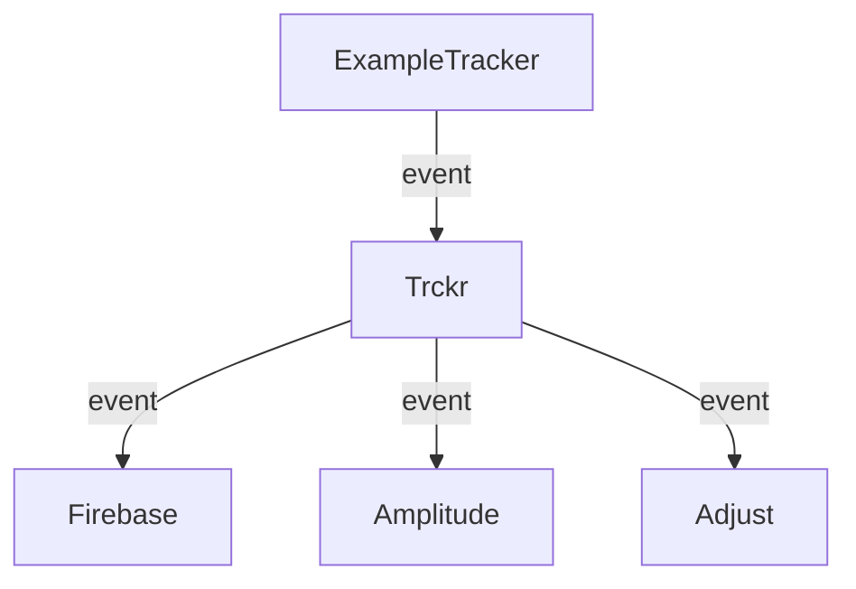
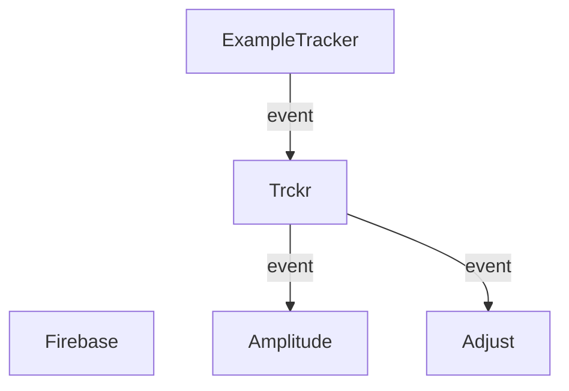

**trckr** is a Kotlin Symbol Processor (**KSP**) library designed to enable concise event tracking to multiple analytics platforms.

In a large project you can have multiple analytics targets that should receive events from your app. That creates a lot of boilerplate code to implement tracker that uses all analytics targets.
Trckr created to eliminate this problem. You need to create target adapters just once, and trckr generate events from interface methods for you.
To declare tracker you define interface, annotated with `@Tracker` annotation and event methods with `@Event` annotation:

```kotlin 
@Tracker
interface ExampleTracker {

    @Event(name = "Event name")
    fun event(
        @Param(name = "Parameter name") data: Int,
    )
}
```

And create instance of tracker using generated method:

```kotlin  
val tracker = createExampleTracker {  
    addAdapter(FirebaseAdapter())
    addAdapter(AmplitudeAdapter())
    addAdapter(AdjustAdapter())
}
tracker.event(data = 42)
```

After calling event method trckr sends it to all registered adapters:

<div class="centered">

</div>

To exclude event from being sent to one of the trackers you should specify this adapter class in `@Event` annotation:

```kotlin 
@Tracker
interface ExampleTracker {

    @Event(
        name = "Event name",
        skipAdapters = [FirebaseAdapter::class],
    )
    fun event(
        @Param(name = "Parameter name") data: Int,
    )
}
```

This code results in `FirebaseAdapter` will be skipped when `event` method would be called:

<div class="centered">

</div>

## R8 / Proguard

Trckr is fully compatible with R8 out of the box and doesn't require adding any extra rules.

## License

```text
Copyright 2022 Dzmitry Pryskoka

Licensed under the Apache License, Version 2.0 (the "License");
you may not use this file except in compliance with the License.
You may obtain a copy of the License at

   http://www.apache.org/licenses/LICENSE-2.0

Unless required by applicable law or agreed to in writing, software
distributed under the License is distributed on an "AS IS" BASIS,
WITHOUT WARRANTIES OR CONDITIONS OF ANY KIND, either express or implied.
See the License for the specific language governing permissions and
limitations under the License.
```
